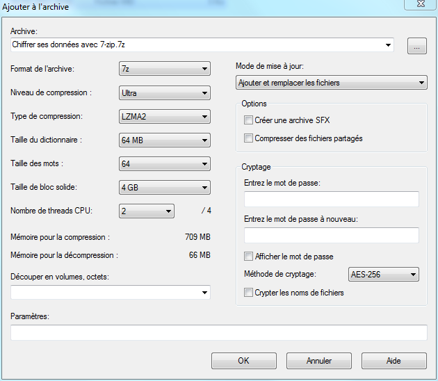
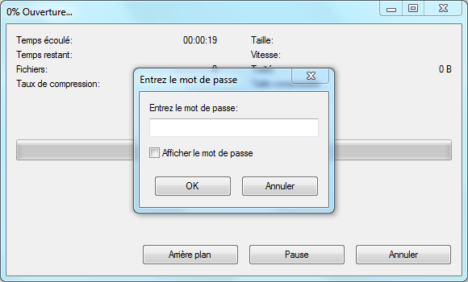

Chiffrer ses données avec 7-zip
===============================

## Sommaire

[toc]

## Prérequis

- Microsoft Windows
- 7-zip ([http://www.7-zip.org/](http://www.7-zip.org/))

## Introduction

Le chiffrement, ou cryptage, consiste à rendre une donnée inexploitable à toute personne ne possédant pas la clé de (dé)chiffrement.

Avec 7-zip :
- on va chiffrer des fichiers et/ou des dossiers
- le chiffrement est dit *symétrique* (la clé de déchiffrement est identique à la clé de chiffrement)
- la clé est un mot de passe

7-zip est avant tout un logiciel de création d'archives, ce qui veut dire qu'il permet de compresser les fichiers avant de les chiffrer.
Créer des archives chiffrées avec 7-zip est donc idéal pour **échanger** des données sensibles ou **stocker** ces données.

Par contre, créer une archive 7-zip chiffrée implique d'avoir les données **en clair** sur son disque dur.
De même, lors de la lecture du contenu d'une archive, 7-zip va l'extraire dans un dossier temporaire pour permettre aux logiciels concernés d'accéder aux données.

Chiffrer ses données grâce à 7-zip ne sécurise donc **pas** les données sur les ordinateurs qui vont créer ou ouvrir l'archive !

L'intérêt est, par exemple, de protéger les données pendant leur envoi par email.
Si l'email est intercepté par une personne tierce, celle-ci ne pourra pas lire les données de l'archive sans son mot de passe.
C'est également appréciable lorsqu'on sait que la plupart des grands fournisseurs de boites email ne suppriment jamais vraiment nos données et y ont accès.

*Pour chiffrer des données sur lesquelles on est en train de travailler, il vaut mieux se tourner vers des solutions de chiffrement à la volée, comme [TrueCrypt](http://www.truecrypt.org/), [GPG](https://fr.wikipedia.org/wiki/GNU_Privacy_Guard) ou [EncFS](http://www.arg0.net/encfs).*

## Chiffrer avec 7-zip

Pour créer une archive chiffrée, il faut procéder de la même manière que pour créer une archive normale avec 7-zip.

La plupart du temps, on sélectionne les fichiers/dossiers qu'on veut placer dans l'archive, on fait un clic droit, et on choisi `7-zip > Ajouter à l'archive...`.
On peut également, depuis la fenêtre de **7-zip File Manager**, sélectionner les fichiers/dossiers et cliquer sur `Ajouter`.

Dans les deux cas, la boite de dialogue de création d'archive s'ouvre :

Voici les principaux réglages pour une archive classique :
- `Archive` : le nom et l'emplacement où sera créée l'archive
- `Format de fichier` : je recommande de choisir **7z** ; **zip** est moins performant mais peut servir pour être sûr que l'archive soit lisible par tout le monde
- `Niveau de compression` : je recommande **Ultra** pour des données de type textuelles, **Normal** pour des médias dans des formats déjà compressés (jpeg, mp3, ...), ou **Aucune** si la compression n'est pas nécessaire ou non désirée (très gros fichiers = compression lente)

Pour chiffrer l'archive, il faut regarder dans la section `Cryptage`.
On a plusieurs réglages :
- le mot de passe avec lequel on veut chiffrer l'archive (il est masqué à la saisie, donc il faut le saisir deux fois)
- `Afficher le mot de passe` permet de ne pas masquer le mot de passe lors de sa saisie et supprime donc un des deux champs de saisie du mot de passe
- `Méthode de cryptage` : je recommande **AES-256**
- `Crypter les noms de fichier` : je recommande de l'activer

Il suffit ensuite de valider et l'archive sera créée !

## Déchiffrer avec 7-zip

Ouvrir une archive chiffrée se fait de la même manière qu'une archive normale.
La plupart du temps, il suffit de double cliquer dessus (depuis l'explorateur de fichiers ou depuis **7-zip File Manager**).

Si `Crypter les noms de fichier` a été coché à la création de l'archive, le mot de passe est demandé :

Lorsque le mot de passe a été saisi, il est possible d'accéder au contenu de l'archive normalement.

Si `Crypter les noms de fichier` n'a pas été coché à la création de l'archive, l'archive s'ouvrira normalement et on pourra voir la liste des fichiers/dossiers qu'elle contient.
Le mot de passe sera demandé dès qu'on accédera à un des fichiers.

## Vulnérabilités du chiffrement

Premièrement, comme expliqué en introduction, 7-zip n'apporte pas de sécurité sur les ordinateurs amenés à créer ou ouvrir l'archive.
L'intérêt est d'empêcher des tiers de pouvoir ouvrir l'archive.

Aucune sécurité n'est infaillible, et il faut comprendre comment une archive peut être ouverte sans la clé.

### Attaques par force brute

Une attaque par force brute (ou *brute-force* en anglais) consiste à essayer tous les mots de passe possibles jusqu'à trouver le bon.

Il existe des variantes, comme *l'attaque par dictionnaire* qui va essayer en priorité des mots de passes communs contenus dans une liste (des mots courants par exemple), dans le but de trouver plus rapidement le bon mot de passe.

Avec du matériel moderne, il est possible de tester très rapidement beaucoup de mots de passe pour un coût relativement faible.
Pour ralentir ce genre d'attaques, il y a deux axes possibles :

- utiliser une large gamme de caractères dans le mot de passe (caractères spéciaux, majuscules, chiffres, ...)
- utiliser un mot de passe long (contenant beaucoup de caractères)

La deuxième solution est bien plus efficace, car le nombre d'essais équivaut au nombre de caractères possibles **puissance** le nombre de caractères du mot de passe.
Par exemple :
- si on utilise les chiffres ainsi que tout l'alphabet avec majuscules et minuscules dans un mot de passe de 5 caractères, cela fait (10+26*2)^5 = **916 132 832 possibilités**
- si on n'utilise que des chiffres dans un mot de passe de 10 caractères, cela fait 10^10 = **10 000 000 000 possibilités** (un peu plus de 10 fois plus que dans le cas précédent !)

D'après la documentation de 7-zip, une organisation avec un budget d'un milliard de dollars et pouvant tester 10 milliards de mots de passe à la seconde (avec une puissance processeur qui double tous les deux ans) mettrait **4 ans** à trouver un mot de passe de **13 caractères**.

### Faille dans l'algorithme de chiffrement

L'algorithme de chiffrement est la méthode qui permet de chiffrer les données.
Comme on peut le voir lorsqu'on crée une archive chiffrée, 7-zip utilise l'algorithme AES-256.

La plupart des algorithmes de chiffrement sont publics et connus de tous, mais sont conçu de manière à ce qu'il ne soit pas possible de déchiffrer des données sans connaitre la clé.
La sécurité repose donc sur la clé, et non sur la méthode de (dé)chiffrement.

Il est déjà arrivé que quelqu'un découvre une faille dans la conception d'un algorithme qui permette de déchiffrer les données sans le mot de passe ou d'accélérer la découverte de ce dernier.
On dit alors que l'algorithme a été cassé.

L'AES date des années 2000, et n'a, pour l'heure, pas été cassé.
Il est utilisé par beaucoup d'organisation et de systèmes divers, et il est peu probable que quelqu'un réussisse à le casser avant un moment.
Et dans ce cas là, nos petites données échangées par email ne seraient pas la cible la plus critique...

## Licence

David Sferruzza, 2013
[Creative Commons 2.0 BY-SA](https://creativecommons.org/licenses/by-sa/2.0/deed.fr)
